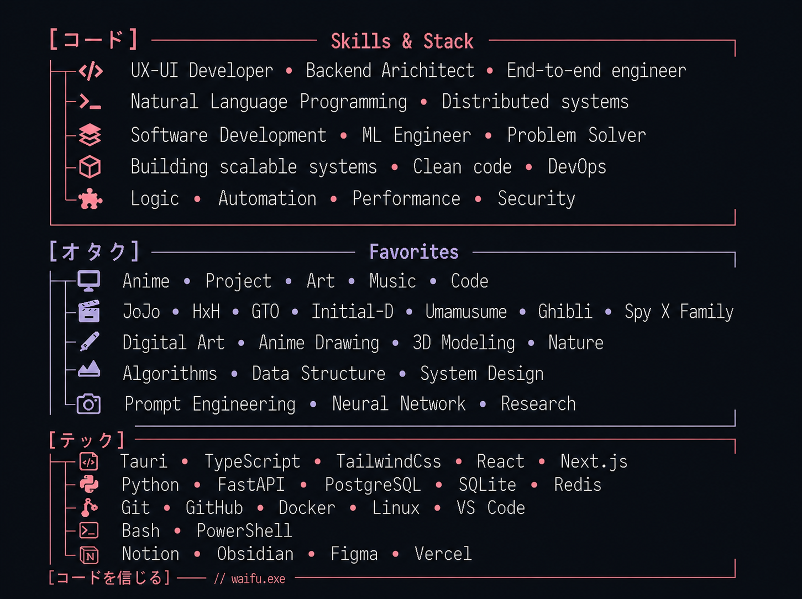
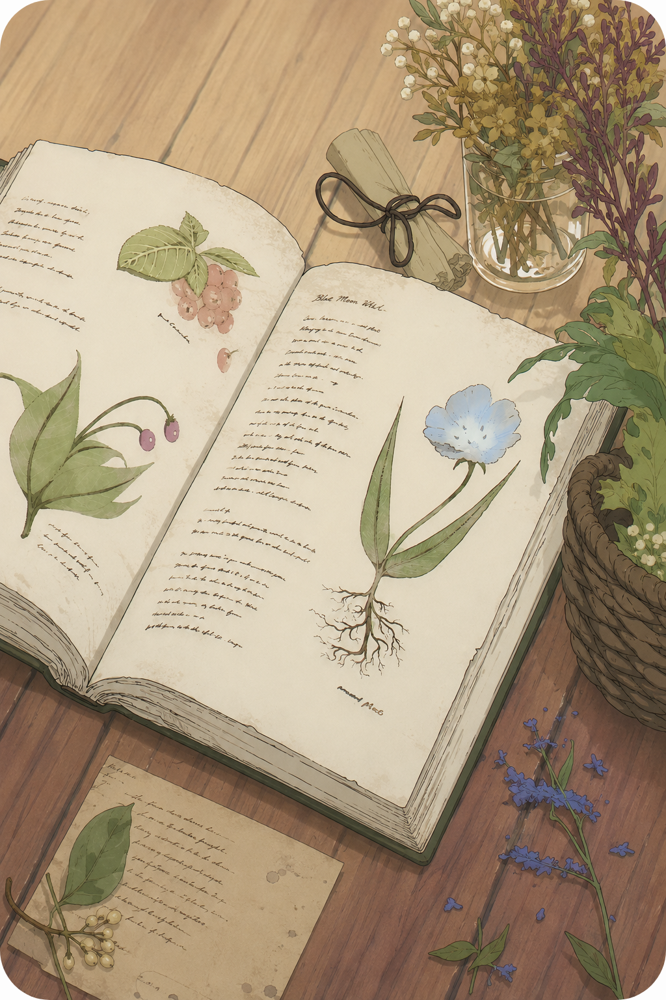

<!--  <pre>
    📌 Fron-end dev • Back-end dev • 10x-Stack
    💻 Software Development • ML Engineer
    📖 Natural Language Programming • Distributed systems
    👾 Anime • Project • Art • Music • Code
    ⛩️JoJo • HxH • GTO • Initial-D • Umamusume • Ghibli • Spy X Family
  </pre>  -->

  <table>
    <tr>
      <td></td>
      <td></td>         
    </tr>
  </table>

 

<!-- 

   

