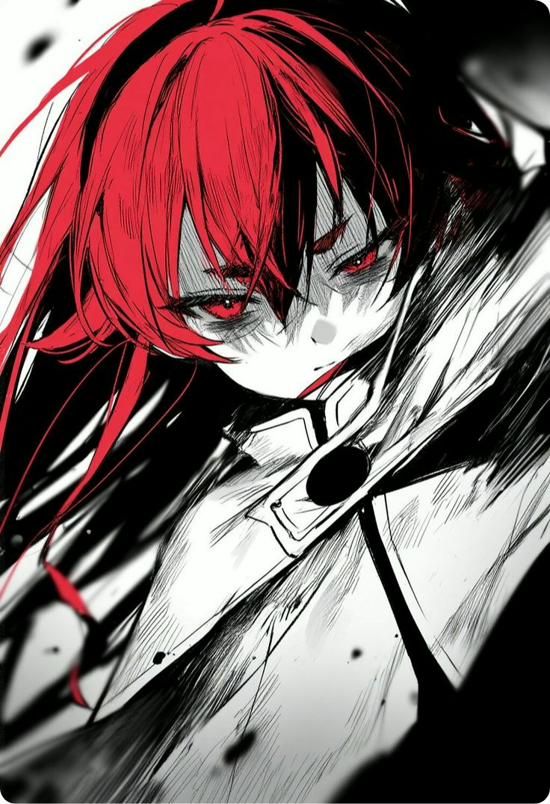

 

  <table style="border: none; width: 100%; max-width: 900px; margin: 0 auto;">
    <tr>
      <td style="vertical-align: middle; padding: 20px; text-align: left; width: 60%;">
        <pre style="font-family: 'Fira Code', 'Consolas', monospace; font-size: 14px; line-height: 1.6; margin: 0; background: transparent; border: none; white-space: pre-wrap; word-break: break-word;">
    📌 Fron-end dev • Back-end dev • AI-Assisted Developer
    💻 Software Development • ML Engineer
    📖 Natural Language Programming • Distributed systems
    👾 Anime • Project • Art • Music • Code
    ⛩️ JoJo • HxH • GTO • Initial-D • Umamusume • Ghibli • Spy X Family
        </pre>
      </td>
      <td style="vertical-align: middle; text-align: right; padding: 10px; width: 40%;">
        
      </td>
    </tr>
  </table>

 

<!-- 

   

