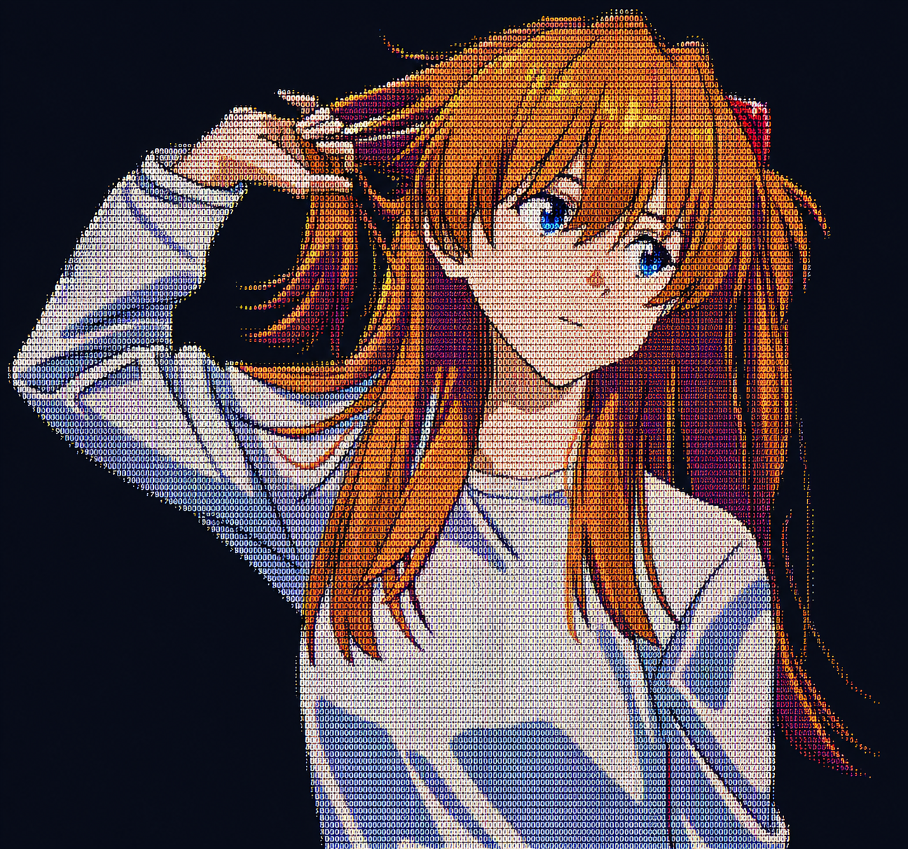

<!--  <pre>
    📌 Fron-end dev • Back-end dev • 10x-Stack
    💻 Software Development • ML Engineer
    📖 Natural Language Programming • Distributed systems
    👾 Anime • Project • Art • Music • Code
    ⛩️JoJo • HxH • GTO • Initial-D • Umamusume • Ghibli • Spy X Family
  </pre>  -->

  <table>
    <tr>
      <td></td>
      <td></td>
    </tr>
  </table>

env:
  GITHUB_TOKEN: ${{ secrets.GH_TOKEN_FOR_GRAPH }}
  GITHUB_USERNAME: ${{ github.repository_owner }}
  LIGHT_THEME: '#ebedf0,#f9a09f,#f55956,#f1120e,#a90c0a'
  DARK_THEME: '#161b22,#600706,#a90c0a,#f1120e,#f55956'

 

<!-- 

   

